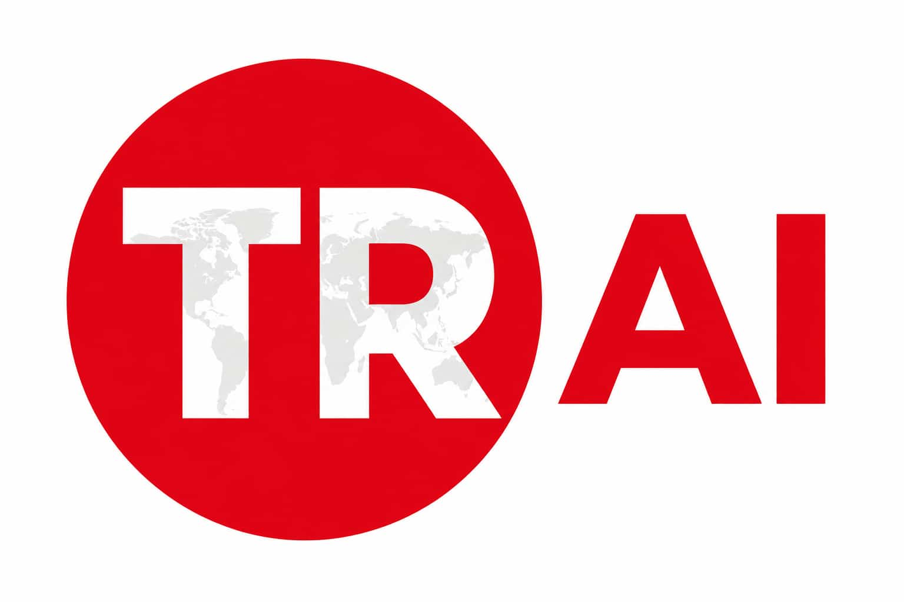

# 👋 Merhaba, Ben **SEZER AI**! 


![Açıklama]


<div align="center">


### 🤖 Yapay Zeka & Yazılım Mühendisi | AI & Software Engineer

**"Gelecek, zekayı mühendisliğe dönüştürenlerindir."**

[](https://kobisme.com.tr)
[](#)
[](mailto:sezerdeveloper@gmail.com)

</div>

---

## 📊 GitHub Analytics

<div align="center">


</div>

---

# 🧠 SEZER AI MVC

### Evidence-Driven ASP.NET Core MVC Audit & Refactoring Skill

**ASP.NET Core MVC projelerini mimari, güvenlik, veri tabanı, performans, test ve kod kalitesi açısından analiz eden gelişmiş AI skill.**


**Kodunu sadece taramaz.  
Mimarini anlamaya, kanıt toplamaya ve güvenli bir refactoring yolu çıkarmaya çalışır.**

</div>

---

## 🚀 SEZER AI MVC Nedir?

**SEZER AI MVC**, ASP.NET Core MVC projeleri için geliştirilmiş kapsamlı bir **audit, architecture analysis ve refactoring planning skill**'idir.

Amaç yalnızca "kod kokusu" bulmak değildir.

Skill;

- repository yapısını keşfeder,
- mevcut mimariyi tespit eder,
- controller ve service sorumluluklarını analiz eder,
- MVC contract'larını kontrol eder,
- Entity Framework Core ve migration zincirini inceler,
- güvenlik ve performans risklerini değerlendirir,
- test kapsamını analiz eder,
- dead / duplicate / incomplete code adaylarını tespit eder,
- cross-layer bağımlılıkları inceler,
- CodeGraph ile semantic dependency analizi yapabilir,
- evidence-backed refactoring planı oluşturur.

Ve bütün bunları varsayılan olarak:

> **READ_ONLY**

modunda gerçekleştirir.

---

## ✨ Temel Özellikler

### 🏗️ Architecture Audit

Projede gerçekte hangi mimarinin kullanıldığını anlamaya çalışır.

Örnek değerlendirmeler:

- Traditional Layered Architecture
- MVC Monolith
- Vertical Slice Architecture
- Clean Architecture
- Modular Monolith
- Hybrid yapılar

Skill popüler olduğu için bir mimariyi önermez.

Öncelik:

> **Projeye en uygun ve en basit yeterli çözüm.**

---

### 🎯 ASP.NET Core MVC Analizi

MVC katmanını detaylı olarak inceler:

- Controllers
- Actions
- Views
- ViewModels
- Partial Views
- Layouts
- ViewComponents
- Routing
- Model Validation
- Authorization
- Form → Action contract'ları

Amaç yalnızca dosya saymak değil, katmanlar arasındaki gerçek ilişkiyi anlamaktır.

---

### 🧩 Controller Responsibility Analysis

Controller'larda bulunan:

- business logic
- persistence logic
- transaction orchestration
- validation logic
- external service calls
- direct DbContext usage

gibi sorumlulukları analiz eder.

Ama her controller'ı otomatik olarak service layer'a taşımaya çalışmaz.

HTTP ve MVC'ye ait sorumluluklar controller'da kalır.

---

## 🗄️ EF Core & Database Truth Analysis

SEZER AI MVC database analizinde farklı doğruluk seviyelerini birbirinden ayırır:

```text
Entity Model
    ↓
EF Configuration
    ↓
DbContext Model
    ↓
Migrations
    ↓
Expected Schema
    ↓
Live Database
````

Live database erişimi yoksa:

> **Live DB verified**

iddiasında bulunmaz.

Bu ayrım, yanlış database sonuçlarını azaltmak için skill'in temel prensiplerinden biridir.

---

## 🔐 Security Audit

Security analizi evidence-first yaklaşımıyla yapılır.

Kontrol edilen örnek alanlar:

* Authentication
* Authorization
* Cookie configuration
* Anti-forgery
* File upload validation
* Secret/configuration usage
* Exception handling
* Security headers
* Rate limiting
* Sensitive logging
* Hard-coded configuration
* Input validation

Bir risk yalnızca kategorisine bakılarak **HIGH** veya **CRITICAL** yapılmaz.

Severity değerlendirmesinde:

* evidence strength
* exposure
* exploitability
* preconditions
* technical impact
* business impact
* compensating controls

dikkate alınır.

---

## ⚡ Performance Audit

Skill potansiyel performans sorunlarını analiz eder:

* N+1 query patterns
* gereksiz database round-trip'leri
* repeated queries
* synchronous I/O
* büyük controller işlemleri
* caching fırsatları
* response optimization
* query projection problemleri

Ancak benchmark yapılmadıysa ölçülmemiş performans sonuçlarını gerçekmiş gibi göstermez.

---

## 🧪 Testing Audit

Projede:

* Unit Tests
* Integration Tests
* Architecture Tests
* Test projects
* Refactoring safety net

incelenir.

Test yoksa bunu gizlemez.

Örneğin:

```text
Test Discovery: COMPLETED
Test Execution: NOT_EXECUTED
Testing Assessment: FINDINGS_PRESENT
```

gibi ayrıştırılmış sonuçlar üretilebilir.

---

## 🕸️ CodeGraph Semantic Analysis

SEZER AI MVC, CodeGraph entegrasyonu mevcut olduğunda semantic code analysis kullanabilir.

Örnek kullanım alanları:

* caller / callee analysis
* dependency direction
* symbol relationships
* blast radius analysis
* circular dependency investigation
* refactoring impact analysis

Ancak:

```text
.codegraph directory exists
```

tek başına execution proof değildir.

Skill gerçek CodeGraph çalıştırma kanıtı ister.

---

## 🔍 Cross-Layer Analysis

Skill yalnızca dosyaları ayrı ayrı incelemez.

Mümkün olduğunda aşağıdaki zinciri takip eder:

```text
View
 ↓
ViewModel
 ↓
Controller
 ↓
Application / Service
 ↓
Domain
 ↓
Entity
 ↓
EF Configuration
 ↓
DbContext
 ↓
Migration
 ↓
Database
```

Amaç katmanların tek tek doğru görünmesinden ziyade, **birlikte doğru çalışıp çalışmadığını** anlamaktır.

---

## 🧹 Code Quality Analysis

Full Audit kapsamında aşağıdaki alanlar da değerlendirilir:

* Dead code
* Duplicate code
* Incomplete implementations
* TODO / FIXME
* NotImplementedException
* Empty catch blocks
* Placeholder flows
* Repeated business rules
* Suspicious unused symbols

Reflection, Dependency Injection ve framework conventions nedeniyle statik analiz sonucu doğrudan "sil" kararı verilmez.

---

## 🧭 Feature Gap Analysis

Skill repository'de görülen davranışlardan hareketle eksik veya yarım kalmış feature'ları araştırabilir.

Örnek sınıflandırmalar:

```text
CONFIRMED_DEFECT
CONFIRMED_INCOMPLETE_IMPLEMENTATION
PROBABLE_FEATURE_GAP
ARCHITECTURAL_OPPORTUNITY
PRODUCT_SUGGESTION
INSUFFICIENT_EVIDENCE
```

Skill yeni ürün özellikleri uydurmaz.

---

## 🧠 Evidence-Driven Analysis

SEZER AI MVC'nin temel prensibi:

> **Evidence yoksa kesinlik yok.**

Her önemli finding mümkün olduğunda şu zinciri izler:

```text
Source Evidence
      ↓
Interpretation
      ↓
Cross-check
      ↓
Finding
      ↓
Confidence
      ↓
Recommendation
```

Build çalıştırılmadıysa:

```text
Build: NOT_EXECUTED
```

Live DB okunmadıysa:

```text
Live DB: NOT_EXECUTED
```

CodeGraph çalışmadıysa:

```text
CodeGraph: NOT_EXECUTED
```

---

## 🧮 Canonical Capability Validation

Yeni nesil Full Audit akışında capability durumları tek bir canonical matrix üzerinden yönetilir.

```text
Canonical Capability Matrix
          ↓
Physical Row Validation
          ↓
Unique Capability IDs
          ↓
Applicability / Execution Aggregation
          ↓
Arithmetic Validation
          ↓
Invariant Checks
          ↓
Overall Audit Status
```

Amaç AI'ın kendi raporundaki sayıları bile doğrulayabilmesidir.

Mümkün olduğunda:

```text
.sezer-audit/capability-validation.json
```

artifact'ı oluşturulur.

---

## 🛡️ READ_ONLY By Default

SEZER AI MVC'nin önemli güvenlik kurallarından biri:

> **Audit yapmak, kodu değiştirmek anlamına gelmez.**

Varsayılan davranış:

```text
READ_ONLY
```

Skill kullanıcı açıkça izin vermeden:

* source code değiştirmez
* migration üretmez
* database değiştirmez
* configuration değiştirmez
* refactoring uygulamaz

Önce analiz eder.

Sonra plan çıkarır.

Değişiklik için ayrıca izin ister.

---

## 📊 Full Audit Çıktıları

Tipik bir Full Audit sonunda `.sezer-audit` altında raporlar oluşturulabilir:

```text
.sezer-audit/
│
├── 00-executive-summary.md
├── repository-inventory.md
├── architecture-audit.md
├── mvc-audit.md
├── application-domain-audit.md
├── database-audit.md
├── security-audit.md
├── performance-audit.md
├── testing-audit.md
├── cross-layer-audit.md
├── findings-register.md
├── refactoring-plan.md
│
├── skil-rapor.md
└── capability-validation.json
```

Dosya isimleri kullanılan agent veya audit sürümüne göre küçük farklılıklar gösterebilir.

---

## 🧪 Skill Self-Evaluation

SEZER AI MVC yalnızca repository'yi değerlendirmez.

Kendi audit performansını da değerlendirmeye çalışır.

Full Audit sonunda:

```text
skil-rapor.md
```

üretilebilir.

Bu rapor skill'in:

* hangi analizleri gerçekten çalıştırdığını,
* hangi alanlarda evidence eksik olduğunu,
* CodeGraph execution durumunu,
* database truth seviyelerini,
* capability coverage durumunu,
* possible false positives / negatives,
* consistency problemlerini,
* geliştirilmesi gereken skill kurallarını

göstermek için tasarlanmıştır.

Bu mekanizma SEZER AI MVC'nin gerçek projeler üzerinde iteratif olarak geliştirilebilmesini sağlar.

---

## 🏛️ Mimari Felsefe

SEZER AI MVC'nin amacı her projeyi aynı mimariye çevirmek değildir.

Örneğin küçük bir MVC uygulamasında:

```text
Controller
   ↓
Application Service
   ↓
DbContext
```

yeterli olabilir.

Her projeye otomatik olarak:

* Repository Pattern
* Clean Architecture
* CQRS
* MediatR
* Modular Monolith
* Microservices

eklemek doğru değildir.

Skill önce problemi anlamaya çalışır.

Sonra en düşük gereksiz karmaşıklıkla çözüm önerir.

---

## 🧰 Örnek Kullanım

AI agent'a:

```text
Bu repository üzerinde sezer-ai-mvc skill'ini kullanarak FULL AUDIT gerçekleştir.

Çalışma modu READ_ONLY.

Skill'in kendi Full Audit protokolü authoritative'dir.
Gerekli audit raporlarını ve skil-rapor.md dosyasını oluştur.

Refactoring uygulama.
```

şeklinde görev verilebilir.

---

## 🤖 Agent-Agnostic Design

SEZER AI MVC belirli bir AI coding agent'a bağlı olacak şekilde tasarlanmamıştır.

Skill uygun entegrasyon sağlandığında farklı coding agent'larla kullanılabilir.

Geliştirme ve gerçek repository testlerinde farklı agent davranışlarının karşılaştırılması da skill'in doğrulama sürecinin bir parçasıdır.

---

## 🎯 Projenin Hedefi

SEZER AI MVC'nin hedefi:

> **ASP.NET Core MVC repository'lerinde AI destekli fakat evidence kontrollü bir yazılım mühendisliği audit standardı oluşturmak.**

Kod analizi yapan bir prompt olmaktan ziyade:

```text
Discover
   ↓
Understand
   ↓
Verify
   ↓
Audit
   ↓
Cross-check
   ↓
Plan
   ↓
Refactor with permission
   ↓
Verify again
```

akışını standartlaştırmayı hedefler.

---

## 🚧 Development Status

<div align="center">

### 🧪 Active Development

SEZER AI MVC gerçek ASP.NET Core MVC projeleri üzerinde iteratif olarak test edilmektedir.

Her test turunda:

**audit → evidence review → skill self-evaluation → rule hardening**

döngüsü uygulanmaktadır.

</div>

---

## 🤝 Katkı

Bug report, false-positive örnekleri, architecture edge-case'leri ve gerçek repository test sonuçları özellikle değerlidir.

Katkı yaparken mümkün olduğunca:

* repository context
* finding evidence
* expected behavior
* actual behavior
* kullanılan agent/tool bilgisi

paylaşılması faydalıdır.

---

## 👨‍💻 SEZER AI

<div align="center">

**AI • Software Engineering • Architecture • Automation**

[](https://github.com/sezerai)
[](https://sezerai.tr)
[](mailto:sezerdeveloper@gmail.com)

### ⭐ Evidence First. Architecture Second. Refactor With Permission.

</div>
